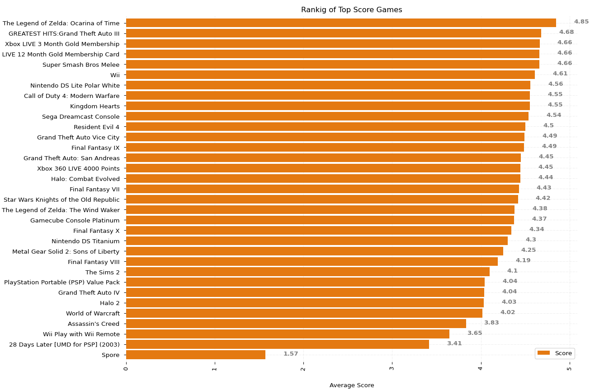

# Final Work of CBD

Final work developed for the **CBD** course on the use of the MapReduce programming model in Apache Hadoop.

## Context

**MapReduce** is a programming model used for processing huge amounts of data. MapReduce program work in two phases, namely, Map and Reduce. Map tasks is responsible for splitting and mapping of data while Reduce tasks lead with shuffle and reduce the data.

The whole process goes through four phases of execution namely, splitting, mapping, shuffling, and reducing.

**Hadoop** is capable of running MapReduce programs written in various languages: Java, Ruby, Python, and C++. The programs of Map Reduce in cloud computing are parallel, thus are very useful for performing large-scale data analysis using multiple machines in the cluster. The Hadoop cluster stores data in a replicated and distributed manner in [HDFS](https://hadoop.apache.org/docs/r1.2.1/hdfs_design.html) (Hadoop Distributed File System).


In this work, **Hadoop Streaming** is used to run any executable in Hadoop MapReduce. Streaming works by passing a data mapper and reducer written in another programming language through standard input and output.

## Objective

The main objective of this work is to implement different data analysis programs using the MapReduce programming model on top of Apache Hadoo. The data to be used for the analysis are a set of reviews of video games sold on Amazon named **Video_Games.txt.gz** (*463,669 reviews 152M*), the source of whose data is : http://snap.stanford.edu/data/web-Amazon-links.html

Finally, in order to improve the visualization of the results, the data are processed to generate a series of graphs. the following technologies have been used to achieve these objectives:  

- MapReduce Programming Model 
-  Apache Hadoop Framework 
-  Hadoop Streaming Implementation with Python 2
-  Python 3.5 matplotlib.pyplot library.

 ### DataSet

Here is a fragment of the content of the default dataset:

```bash
cat Video_Games.txt | head -n 20
product/productId: B000068VBQ
product/title: Fisher-Price Rescue Heroes: Lava Landslide
product/price: 8.88
review/userId: unknown
review/profileName: unknown
review/helpfulness: 11/11
review/score: 2.0
review/time: 1042070400
review/summary: Requires too much coordination
review/text: I bought this software for my 5 year .....

product/productId: B000068VBQ
product/title: Fisher-Price Rescue Heroes: Lava Landslide
product/price: 8.88
review/userId: A10P44U29RNOT6
.....
```

To make it easier to work with this dataset, it has been parsed to a json file, where each line is a new review. Using this you get a new file **Video_Games.json** with this content:

```bash
$ ./converter.py
$ cat Video_Games.json | head -n 2
{"review/profileName": "unknown", "product/price": "8.88", "review/time": "1042070400",
"product/productId": "B000068VBQ", "review/helpfulness": "11/11", "review/summary
": "Requires too much coordination", "review/userId": "unknown", "product/title":
"Fisher-Price Rescue Heroes: Lava Landslide", "review/score": "2.0", "review/text"
: "I bought this software for my 5 year old. ..."}
{"review/profileName": "unknown", "product/price": "8.88", "review/time": "1041552000",
"product/productId": "B000068VBQ", "review/helpfulness": "9/10", "review/summary"
: "You can't pick which parts you want to play!", "review/userId": "unknown", "
product/title": "Fisher-Price Rescue Heroes: Lava Landslide", "review/score": "2.0
", "review/text": "I got this f......."}

```
 ### Local Test

For local testing it is necessary to use python 2, for more convenience, you can use Docker, as in the following example:

```bash
docker run -it --rm --name my-py2-tester -v "$PWD":/usr/src/myapp -w /usr/src/myapp python:2
```

Inside of container, launch de following commands for simulate the programming model MapReduce:
```
./converter.py
```
#### Launch
```bash
cat Video_Games.json | head -n 300 | ./1-task/mapper.py | sort -k 1,1 | ./1-task/reduce.py
```
### Cluster Hadoop

In this section, the steps to follow to work with HDF under a Hadoop cluster with Hadoop Streaming installed. 

Parse Video_Games.tgz to json 
```bash
./converter.py
```
Create a HDFS folder 
```bash
$ hadoop fs -mkdir videogames-alucloud31
```
Copy Dataset to new folder
```bash
$ hadoop fs -put Video_Games.json videogames-alucloud31
$ hadoop fs -text videogames-alucloud31/Video_Games.jso
```
#### Launch

To simplify the launching of a streaming hadoop job on the cluster, the hs.sh script has been used, the contents of it are:
```bash
#!/bin/bash
/opt/hadoop/bin/hadoop jar /opt/hadoop/share/hadoop/tools/lib/hadoop-streaming-*.jar \
-mapper $1 \
-reducer $2 \
-file $1 \
-file $2 \
-input $3 \
-output $4
```
Here an example:
```bash
alucloud31@ubuntu:~/1-task$ ../hs.sh mapper.py reducer.py videogames-alucloud31/Video_Games.json videogames-alucloud31/output
```
Finally, it's possible to view the result and copy it to a local folder:

```bash
#
# show result in hdfs
#
$ hadoop fs -text videogames-alucloud31/output1/part-00000
#
# copy to local folder
#
$ hadoop fs -text videogames-alucloud31/output1/part-00000 > part-00000
```

#### Example - Task 3

The final rating of a product in the Amazon shop is the result of the average of all the reviews, with the lowest review being one star and the highest being 5 stars, as shown in the following picture:


Therefore, we want to get for each game its average score, as well as the count of scores of each type, since the score can only be 1, 2, 3, 4 or 5.

##### Launch the task
```bash
alucloud31@ubuntu:~/3-task$ ../hs mapper.py reducer.py videogames-alucloud31/Video_Games.json videogames-alucloud31/output
alucloud31@ubuntu:~/3-task$ hadoop fs -text videogames-alucloud31/output1/part-00000 > part-00000
alucloud31@ubuntu:~/$ cat 3-task/part-00000 | head -n 5
"PSP, 3 PACK SCREEN PROTECTOR" 3.0  2      1 : 0 : 0 : 0 : 1
$100,000 Pyramid      4.18181818182 22     0 : 1 : 4 : 7 : 10
'N Sync Hotline Fantasy Phone and CD-ROM Game 3.8 15     3 : 0 : 1 : 4 : 7
'Nam (Jewel Case)     3.0    6      2 : 1 : 0 : 1 : 2
(2 Pack)GameShark 2.4 Ghz Wireless MicroCON- PS2 and PS2 (slim)  2.5    2      1 : 0 :0 : 1 : 0
```
##### Matplot

The following scripts can be used for displaying the results of task 3:
```
python3 3-matplot-best-rated.py
```


```
python3 3-matplot-bestrated-ranking.py
```



git filter-branch --index-filter 'git rm -r --cached --ignore-unmatch Video_Games.txt.gz' HEAD